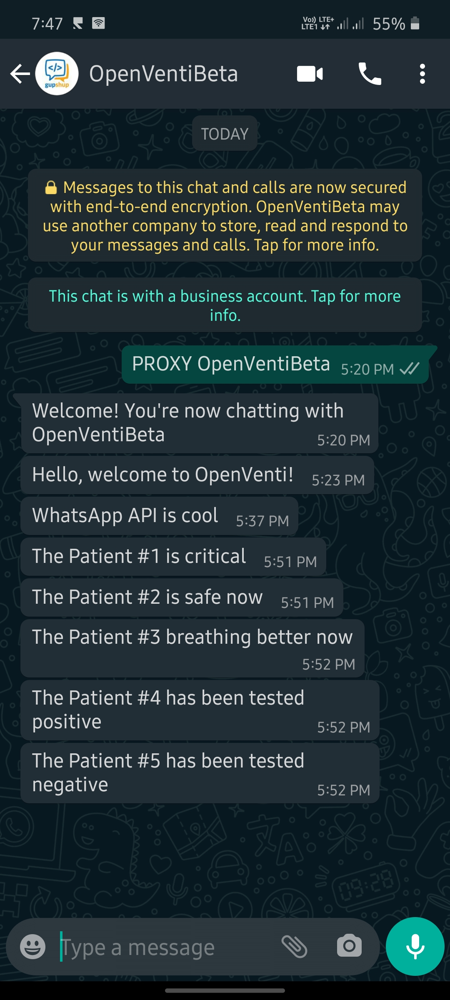

# WhatsApp Alert Bot library in C



Here is a sample program to use the library:

```c
// example.c
#include <stdio.h>
#include "whatsapp_alert.h"

int main()
{
    char *message = "Hi, What's up?"
    char *number = "9194xxx3xx29"; // number with country code prefix

    if(whatsappSendMessage(number, message)) {
        puts("Message sent!");
    } else {
        puts("Message wasn't sent.");
    }
    
    return 0;
}
```

Compile as follows:

```bash
gcc example.c whatsapp_alert.c -lcurl
```


This library was originally written for [OpenVenti](https://gitlab.com/iotiotdotin/open-ventilator/patient-monitoring/openpmd/-/merge_requests/22) by me.

[See documentation >>](docs/Creating-the-Bot.md)